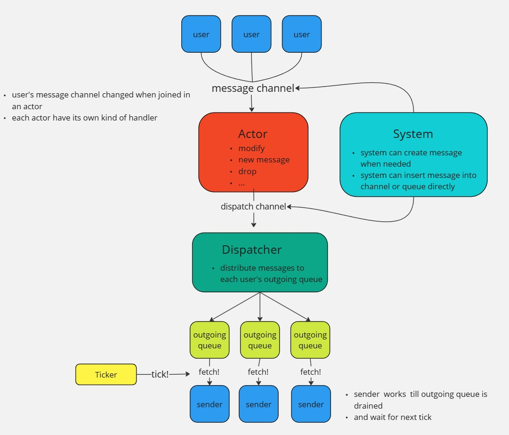

  

# Introduction

This is open source realtime multiplayer game server project in Go, can play using [animalized-client](https://github.com/BJS-kr/animalized-client). Initial purpose of this project was make a template Go based game server. I couldn't find any descent, open sourced game server project implemented in Go. So, I made my own(maybe this project bit gone too far for a template).

Unfortunately, I have no game server experience at production level. So if something looks unsuitable or if there any suggestions, please, let me know.

# Key Features

1. Avoiding potential blocks by [lock-free queue](queue/queue.go)(Yes, it could be dangerous. I'll explain it in Details)
2. TCP(only) server - I used [protobuf](https://protobuf.dev/), but protocol or packet parsing rule can be differed. choice is all yours 
3. [Actor](https://en.wikipedia.org/wiki/Actor_model), [Fan-out](https://en.wikipedia.org/wiki/Fan-out_(software)) pattern used for simple processing
4. Most of surface models based on internal models for reusability - e.g [DistSession](users/dist_session.go)
5. [deterministic lockstep](https://www.linkedin.com/pulse/deterministic-lockstep-networking-demystified-zack-sinisi-jqrue) synchronization - because this game is realtime battle simulation

# Flow

  

# Details
### How packet parsed?
1. Receive byte length
2. read amount of received byte length
3. parse into message
4. repeat

You can see the code at [packet_store.go](packet/packet_store.go).

### How messages propagated?
All users are placed in actors. actors may vary, like lobby, room, game.
Actor receives all messages from owned users sequentially.
When actor receives message, it process the message, and fan-out to users.
actor may add message content, create new message, or drop the user message that don't have to be propagated.

  

### Why Dispatcher do not directly send message but insert into queue?
dispatcher must guarantee same distribution performance. if distribution & sending occurs in single flow, performance cannot be guaranteed because user connection unstable or slow, overall distribution performance would not consistent.
so, distributor and sender should be separated and communicate via outgoing queue. This approach is based on common programming practice: separate pure functions and I/O operations. 

### How user moved to another actor?
Users pass message to target channel. Message channel can be changed.
If user moves to another actor(e.g lobby -> room), message channel also changes.

### How tick used?
This project uses ticks not only for in-game, but for all situation.
For example, lobby's tick rate is 200ms. Users in lobby receive queued messages every 200ms and consume.
Game's tick rate is 2ms, obviously for fast sync.

### Why Lock-free Queue? (WHY NOT CHANNEL OR MUTEX?)
#### Lock-free DS are not always fast and have pitfalls
Let's talk about general problems.

1. If spin lock used(I did), it can occur greater latency.
2. Simple is the best. Fancy algorithm tends to buggier and hard to change.
3. CAS implies ABA problem

I totally agree with those problems, but here's why I used it.

Answer to 1. Lock-free is not suitable for high contention. It'll cause random latency and complex problems. In this project, lock-free queue is used for data receiving between dispatcher and sender only. It means there is no high contention but there are one queueing goroutine, and one dequeueing goroutine. Performance is quite expectable and beat up mutex case always. You can check out the benchmark [here](queue/queue_test.go).

Answer to 2. I agree with that. Sincerely.

Answer to 3. Implementation and usage are monotonic in this project. ABA problem does not occurs in monotonic operation.

Not an answer for problems but another reason to use: It does not occur blocks. Let me explain it later(in "When it's better than channels").

#### Why not sync.Map
It's simple. It does not guarantees order.
#### When it's better than channels
I prefer channels in most cases. Actually, I used channel a lot in this project. I have only one standard. If "block" makes sense, I can use a channel. 

A situation that block makes sense is "expected" or "natural". For example, I used channel between Actor & Dispatcher. It makes sense because if  Actor processing itself is slow, Dispatcher receives message pace with actor. Users might have bad experience but it is a server problem that can be fixed, and it is totally fair because all users receives message at a same pace.

Then, what is the situation that block makes no sense? Let's assume that some users have bad network condition. Message consume is slowed down because writing to TCP connection is slowed down. Eventually, channel will be overflowed and block the whole operation. It is not "natural" because most of users were in good network condition.

Some might say channel can be buffered. Let's talk about that case.

How much space would suitable for buffered channel, especially for fast stacking messages? What if consumer slowed down for times and overflowed? Like I mentioned, it cannot be guaranteed regardless it's reserved buffer length. It always implies hazard.

And some other might say channels can be length measured, and can prevent blocks. Here's the second problem. If you want to prevent block by measuring channel buffer length, you have to measure it every single iteration. Length of Go data structure can be cached ONLY if that ds used in local. If ds referred outside, length cannot be cached and Go actually counts it.

#### When it's better than mutex + slice

ADD: I implemented this architecture before move to lock-step. This project currently uses ticks. So maybe mutex and slice would have better performance and simplicity. Even so, I did not changed because it works fine now and still can win against non-tick based operations

In my experience, using lock all around was a pure evil. I do not want to say it is a reason to prefer lock-free over mutex. It is just a SKILL ISSUE. but still, lock-free can free me from deadlock a bit.

My main concern was performance. As mentioned above, data receiving process is not highly contented with many goroutines, but highly lock requested from two goroutines, dispatcher and sender. I benchmarked this case and in my machine(Ryzen 7700), lock-free queue outperforms mutex + slice.

# Game Rules

